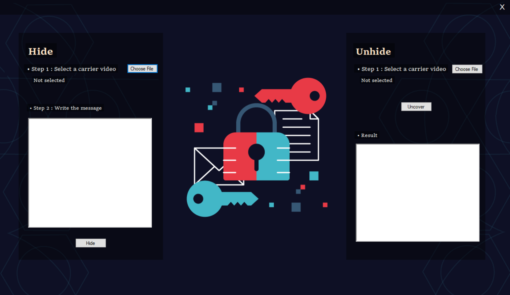

<h1 align="center">Video-Steganography</h1>
•This code allows user to hide text with up to 65.535 letters (including spaces). 
•The code also allows user to reveal the text from videos. 
•The G and B values of the last pixel of the first frame holds the lenght of the text. It's calculated as; 
•B.value + G.value * 256;
 
 

<h2>Used Dependencies</h2>
•Accord.Video.FFMPEG 
•FFMpegSharp 
•FFMpegSharp.FFMPEG 
•AviFile 
•NAudio 

<h2>UI</h2>
• The first screen when user runs the code. 

  

<h2>During Hide Process</h2>

  

<h2>After Unhide</h2>

  

